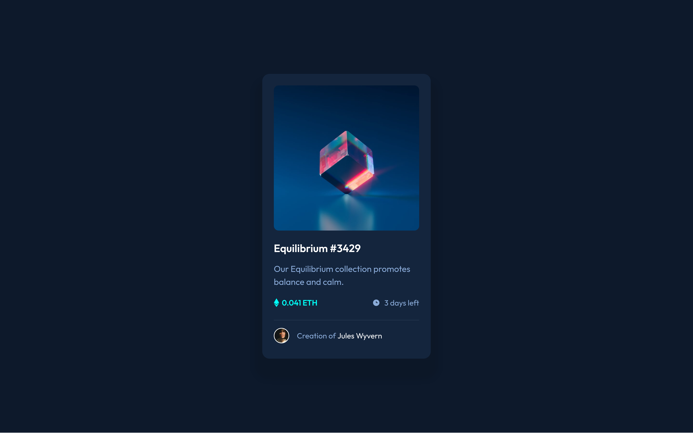

# Frontend Mentor - Social links profile solution

This is a solution to the [NFT preview card component challenge on Frontend Mentor](https://www.frontendmentor.io/challenges/nft-preview-card-component-SbdUL_w0U). Frontend Mentor challenges help you improve your coding skills by building realistic projects. 

## Table of contents

- [Overview](#overview)
  - [The challenge](#the-challenge)
  - [Screenshot](#screenshot)
  - [Links](#links)
- [My process](#my-process)
  - [Built with](#built-with)
  - [What I learned](#what-i-learned)
  - [Continued development](#continued-development)
  - [Useful resources](#useful-resources)
- [Author](#author)

## Overview

### The challenge

Users should be able to:

- See hover and focus states for all interactive elements on the page

### Screenshot

### Links

- Solution URL: [GitHub](https://github.com/marisudris/frontend-mentor-nft-preview-card-component)
- Live Site URL: [GitHub Pages](https://marisudris.github.io/frontend-mentor-nft-preview-card-component/)

## My process

### Built with

- Semantic HTML5 markup
- CSS custom properties
- Flexbox
- Mobile-first workflow

### What I learned

This was just a recap of my CSS knowledge. I used mostly classic box and flex layout.

### Continued development

Research more on hover overlays.

### Useful resources

- [Clamp calculator](https://www.marcbacon.com/tools/clamp-calculator/) - This was useful for generating `clamp()` value for fluidly responsive card padding, instead of using media queries and "snappy" padding sizes.

- **Pixel Perfect Pro** add-on available for both Chrome and Firefox browsers. This was useful for making quicker comparisons between the design and my solution..
## Author

- Frontend Mentor - [@marisudris](https://www.frontendmentor.io/profile/marisudris)
